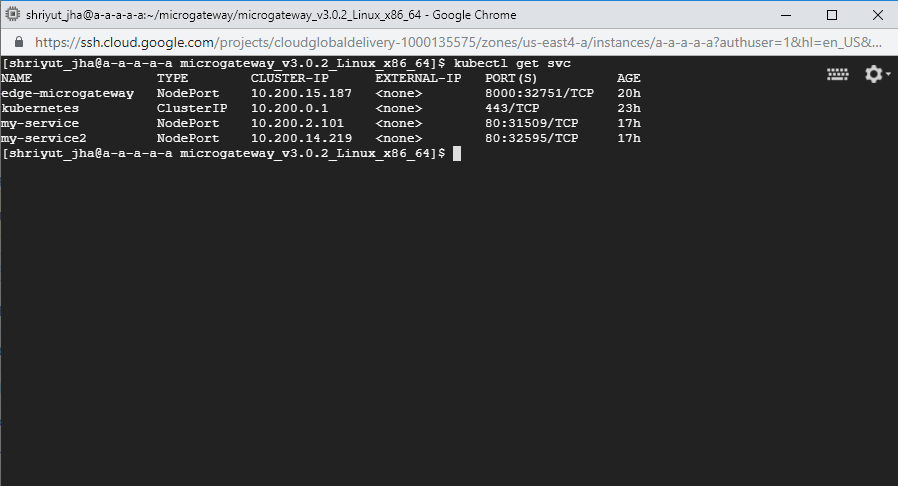
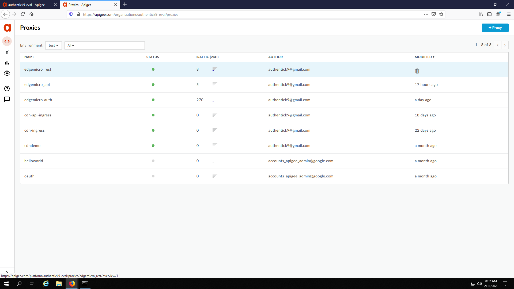
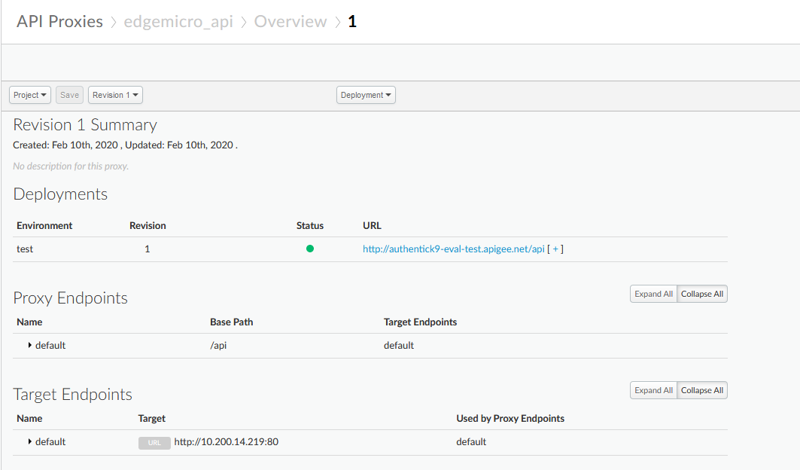
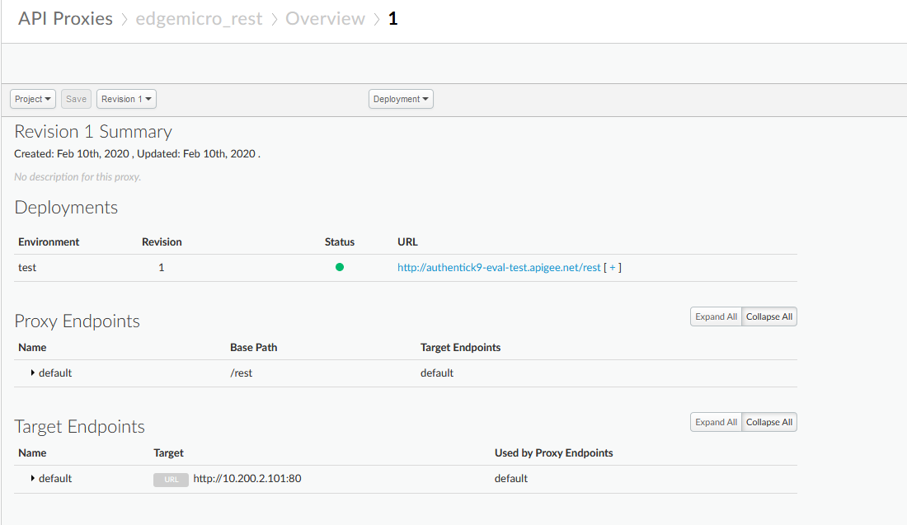
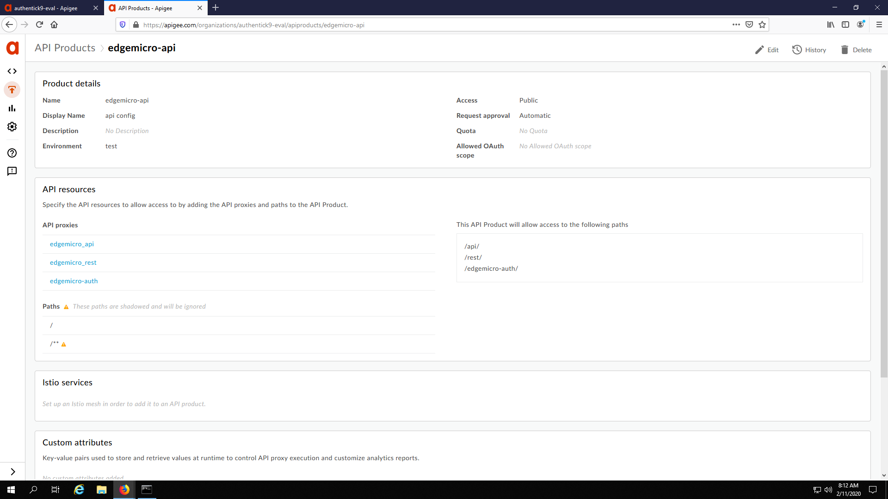
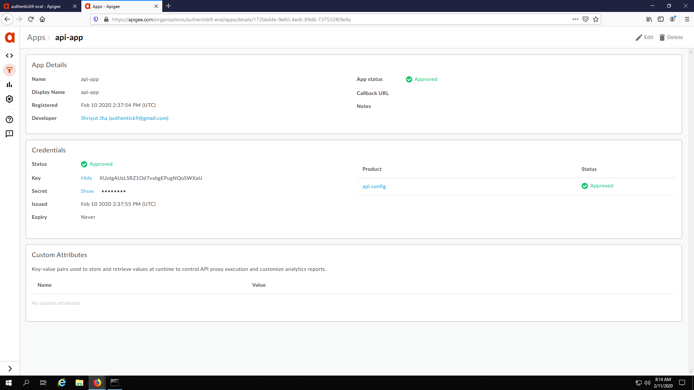
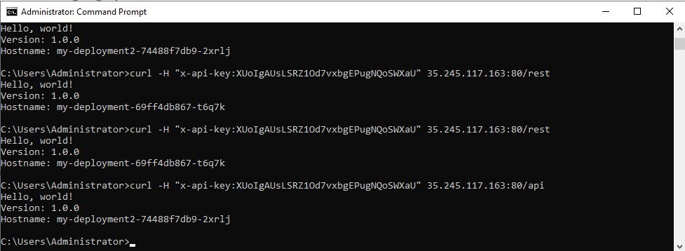

# apigee-docs

https://github.com/apigee-internal/microgateway/issues/269

The desired setup looks like this with edge microaware proxies for routing traffic

The micro aware proxies have been configured like this

The API Product

App

Api calls

